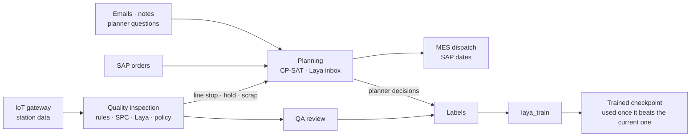

# SmartMom

**A smart-factory MOM (manufacturing operations management) platform with AI at the edge.**
SmartMom inspects every unit on a production line, plans and repairs the plant schedule,
and reads what people write (operator notes, emails, planner requests) in any language,
all on one laptop CPU. Every claim in its documents comes with a measured number.

The AI is [Laya](LAYA.md), a small, fast classifier with calibrated confidence. SmartMom uses
it only where measurements showed it helps; rules, a solver and people decide everything
else.

```bash
./run.sh start          # → http://127.0.0.1:8100/   (./run.sh help lists every command)
```

## What it does

| Module | What it does | Docs |
|---|---|---|
| **Quality inspection** | Collects station data from an IoT gateway, judges it with rules and SPC, reads operator notes with Laya, releases or holds each unit with a stored reason, and sends doubtful units to QA review | [`demos/quality_inspection`](demos/quality_inspection/README.md) |
| **Planning (APS)** | Schedules SAP-shaped orders with a CP-SAT solver for on-time delivery, repairs the plan when a machine fails or an order changes, runs what-if scenarios, explains why an order is late, and turns emails and planner questions into events | [`demos/aps`](demos/aps/README.md) |
| **Platform** | Every module in one process with one shared Laya model; quality problems (line stops, holds, scrap) reach planning as suggested events | [`demos/platform`](demos/platform/README.md) |
| **Laya training** | Saves every planner decision on a Laya reading as a label; evaluates, calibrates and fine-tunes Laya; shows every run with its curves | [`laya_train`](laya_train/README.md) |
| **Laya service** | The HTTP service behind Claude Code's Laya tools and the WebFetch prompt-injection guard | [`GUIDE.md`](GUIDE.md) |



## Measured on a laptop

A 2019 Intel laptop CPU, synthetic plant data, default time limits. The scripts that
produce these numbers are in the repository (`evaluate.py` in each demo, `laya_train`).

| | Result |
|---|---|
| Quality: fault scenarios | every scenario ends in its expected disposition |
| Quality: tool wear | the line stops 3 units before the first out-of-tolerance part |
| Quality: Laya per operator note | 456 ms median, 575 ms p95 |
| Planning: on-time orders | 35 of 36 with CP-SAT, against 28 of 36 for a due-date rule |
| Planning: weighted lateness | 3.3 h, against 62.4 h for the due-date rule |
| Planning: repairs (13 cases, 10 kinds of events) | 0.5–30 s each, no feasibility violations |
| Planning inbox: wrong events that applied themselves | 0 (two differently worded Laya readings must agree) |
| Laya fine-tuned on 41 planning messages | held-out accuracy 63% → 78%, calibration error 0.22 → 0.08 (a demonstration: too little data to deploy) |

The documents also say where Laya falls short. It could not tell a confirmed report from a
possible one, or read urgency, so rules do that. It misses most early warnings in shift
notes. And its multilingual checkpoint ships uncalibrated.

## Quick start

Requirements: Python 3.11 (3.10–3.13 work for the library); about 4 GB of free memory for
the platform with the real model, 8 GB with the Laya service as well; and a network
connection the first time (the Laya checkpoints download once, about 2.2 GB).

```bash
pip install -e . fastapi uvicorn httpx "ortools==9.10.4067" "numpy<2"
./run.sh start                     # the platform, in the background
./run.sh status                    # what is running
./run.sh start platform --mock     # no model: starts in seconds, for UI work
./run.sh stop all
```

`ortools` is pinned because newer releases need numpy 2, and torch 2.2 (the newest on
Intel Macs) needs numpy 1.x. `GUIDE.md` covers the environment in detail.

| Page | What you find there |
|---|---|
| http://127.0.0.1:8100/ | Portal: every module at a glance (EN / 中文) |
| http://127.0.0.1:8100/quality/ | Quality inspection: live line, alerts, QA queue |
| http://127.0.0.1:8100/aps/ | Planning workbench: Gantt, orders, inbox, command bar, what-if |
| http://127.0.0.1:8100/training/ | Laya training runs: data, settings, improvement curves |
| http://127.0.0.1:8100/laya/ | Laya console: ask your own typed questions |
| http://127.0.0.1:8100/docs/ | The design documents |

## Documents

| Document | About |
|---|---|
| [Smart factory edge platform](docs/smart-factory-edge-platform.html) | Architecture with charts: edge nodes, plant hub, data, AI, security, rollout |
| [Platform architecture](docs/smart-factory-platform-architecture.md) | The same design as text: layers, Laya and LLM roles, decision policy |
| [Plant APS design](docs/plant-aps-design.html) (EN / 中文) | Planning levels, scheduling model, SAP and MES integration, measured results |
| [APS workbench guide](docs/aps-workbench-guide.html) (EN / 中文) | How planners use the workbench |
| [GUIDE.md](GUIDE.md) | Environment, the Laya service, MCP tools, the WebFetch guard |
| [LAYA.md](LAYA.md) | The Laya library: API, presets, benchmarks, fine-tuning |

## Repository layout

```
demos/quality_inspection/   quality inspection: gateway, rules, SPC, Laya engine, dashboard
demos/aps/                  planning: SAP adapter, CP-SAT solver, inbox, workbench, labels
demos/platform/             every module in one process, portal
laya_train/                 evaluate, calibrate and fine-tune Laya; training report
laya/                       the Laya library (see LAYA.md)
webui/                      the Laya console and service
mcp_server/                 Laya tools for Claude Code, WebFetch guard hook, launchd job
docs/                       design documents
run.sh                      start, stop and watch every server
```

## Contributing

Open a pull request. `main` changes only through reviewed pull requests; nobody pushes to
it directly, and branches cannot be force-pushed or deleted. [CONTRIBUTING.md](CONTRIBUTING.md)
lists the tests to run for each part of the code and the rules for changes: numbers come
from measurements, documents change with the code, and no plant data goes into git.

## Status

A working demonstration. It runs on synthetic plant data with simulated SAP, MES and
gateway connections. The next steps (real equipment and ERP connections, the plant hub,
vision, predictive maintenance) are in the design documents.

## License and credits

Apache 2.0 (see [LICENSE](LICENSE)). SmartMom builds on
[Laya](https://github.com/NandhaKishorM/laya) by Convai Innovations; its documentation is in
[LAYA.md](LAYA.md). Scheduling uses [Google OR-Tools](https://developers.google.com/optimization).
