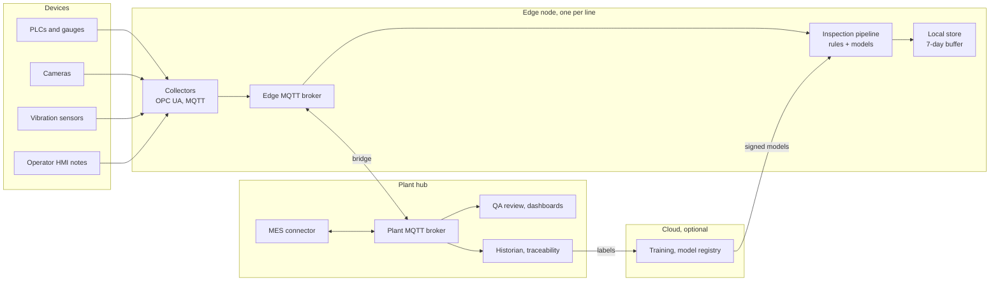
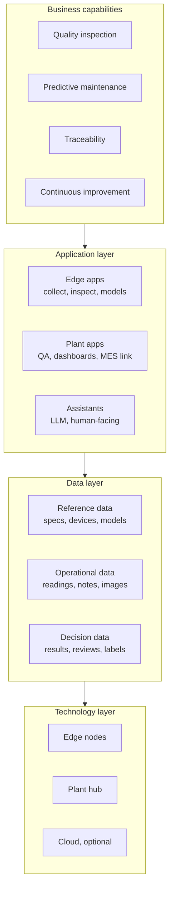
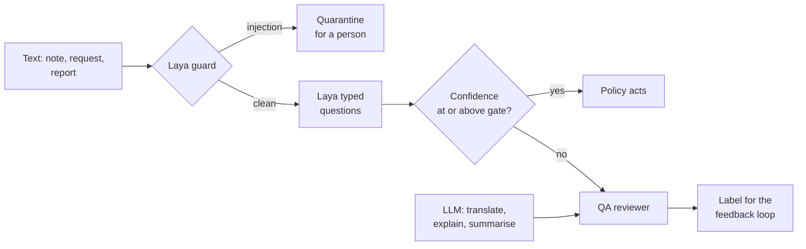
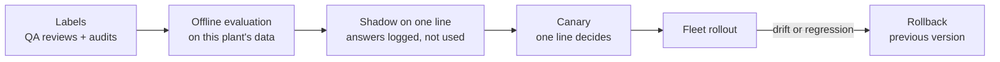

# Smart Factory Platform: Architecture Design

Sep 23, 2026

## Goals and scope

The platform grows the Line 3 quality-inspection demo into a plant-wide system. It inspects every unit, predicts machine failures, and learns from QA decisions. Each line runs on its own edge node and keeps working when the plant network or cloud is down.

The design covers four capabilities, built on one shared backbone:

1. **Edge and plant backbone:** OPC UA and MQTT data collection, one edge node per line, a plant hub.
2. **Vision defect detection:** camera inspection at the edge, in addition to today's vision score.
3. **Predictive maintenance:** anomaly detection on vibration and load signals, warning before a machine degrades.
4. **Feedback loop:** QA review decisions become labelled data that measure and retune every model.

| Goal | Proposed target | Today (Line 3 demo) |
| --- | --- | --- |
| Every unit has a disposition and a stored reason | 100% of units | Met in the demo |
| Units released without a person | ≥ 90%, with zero escaped defects from auto-release | 96% in a simulated run |
| Drift caught before bad parts | Line stop ≥ 1 unit before the first out-of-tolerance part | 3 units early in the tool-wear scenario |
| Line keeps inspecting through an outage | 24 h without plant hub or cloud | Store-and-forward in the gateway only |
| Predictive maintenance warning lead time | Open: needs failure history | Not built |

The targets are proposals for the team to confirm; the demo figures come from the simulator, not a real line.

**Scope:** Line 3 (five stations, HSG-7731 pump housing) first, then every line in the plant, then more plants.

**Non-goals:**

- AI never writes to a PLC or controls a machine. It recommends; people and PLC logic act.
- Safety functions stay in safety-rated PLCs, outside this platform.
- The platform does not replace the MES or ERP. It reads work orders from the MES and writes results back.
- No generated text makes a disposition. Laya classifies; it does not write.

## Design principles

Six rules decide every trade-off below. Most come from what the Line 3 demo measured.

| Principle | What it means in practice |
| --- | --- |
| Deterministic where it matters | Tolerances, reaction plans, SPC and alarm codes are rules, versioned like code. A model can hold a part; it can never release a part the rules failed. |
| Each model reads what it is good at | Laya reads text people write. Vision models read images. Signal models read vibration and load. None of them judges a measured number against a tolerance. |
| Calibrated gates, not raw scores | A model acts alone only above a confidence threshold set from measured error rates on this plant's data. Below it, a person decides. |
| Edge first | Everything a line needs to inspect and disposition runs on its edge node. The plant hub and cloud improve the system; neither is required for a unit to be inspected. |
| Every decision is reconstructable | Each disposition stores its raw inputs, model versions, answers, rule results and the policy trace. |
| People close the loop | Every held unit is reviewed by a named person. Those reviews are the labels that measure and retune the models. |

When a principle conflicts with throughput, the principle wins: a held part costs minutes, an escaped defect costs a recall.

## System overview

The platform has four tiers. Data flows up from devices; decisions are made at the edge; models flow down from the cloud.



Reading left to right: devices publish to the edge, the edge decides, the plant hub shows and records, the cloud trains.

| Tier | Runs | Needs the tier above to work? |
| --- | --- | --- |
| Devices | PLC logic, sensors, cameras, the operator HMI | No |
| Edge node | Data collection, rules, SPC, Laya, vision and signal models, local store | No: buffers up to 7 days and syncs when the link returns |
| Plant hub | Cross-line dashboards, QA review, historian, MES link, alert routing | No for inspection; yes for cloud training |
| Cloud | Training, evaluation, model registry, fleet rollout, cross-plant analytics | Optional; an on-prem deployment can run these on the plant hub |

The Line 3 demo already contains the edge pipeline and a slice of the plant hub in one process. The build plan splits it along these lines.

## Layered architecture

The platform is described in three layers under the business capabilities it serves: data, application and technology. Each layer depends only on the one below, so a database, broker or model runtime can be swapped without redesigning the applications.



Read top to bottom: each capability is delivered by applications, which read and write the data, which runs on the technology.

| Layer | Answers | Owned by |
| --- | --- | --- |
| Business | What the plant needs: fewer escapes, less downtime, full traceability | Plant quality and operations leads |
| Application | Which software does what, and how the parts talk | Platform engineering |
| Data | What is recorded, where it lives, who owns it, how long it is kept | Quality engineering, with IT for governance |
| Technology | What it runs on: hardware, OS, runtimes, network, security | IT and OT infrastructure |

The tier view in the system overview and this layer view are two cuts of the same design: every application, data store and technology component below sits on exactly one tier.

### Data layer

Data falls into three domains with different owners and lifetimes. The serial number is the key that joins them all; every record of a unit can be found from it.

| Domain | Contents | System of record | Where it lives |
| --- | --- | --- | --- |
| Reference | Part specs and revisions, tolerances, reaction plans, stations, device registry, alarm codes, model, rule and policy versions | MES for specs; the platform registry for the rest | Plant hub; a signed copy on each edge node |
| Operational | Measurements, operator notes, images, signal features, machine status | The edge node, until synced | Edge for 7 days; plant historian and image archive after |
| Decision | Inspection results, alerts, QA reviews, audits, labels, evaluation reports | The plant traceability store | Plant hub; labels and reports also in the cloud for training |

**Core entities:**

| Entity | Key | Links to |
| --- | --- | --- |
| Unit | serial | Work order and part revision (from the MES) |
| Station visit | serial + station | One unit at one station: its readings, note, images, signal window |
| Reading | device + seq | A station visit; values per characteristic |
| Note | device + seq | A station visit; text, language, pseudonymous operator id |
| Image | content hash | A station visit; heatmap and vision score |
| Signal window | machine + time window | Machine; features and health index |
| Inspection | station visit | Disposition, reasons, trace, policy version, each model's version and answer |
| Review | inspection | Reviewer, decision, note, time |
| Alert | station + level while open | The inspections that raised it, reasons, likely cause |
| Label | inspection | The truth for its inputs, from a review, an audit or a downstream finding |

**Rules for the data layer:**

- **Schemas are versioned** (`measurement/v1`, `inspection/v2`). A consumer rejects versions it does not know; old versions stay readable.
- **Lineage is stored, not reconstructed:** every inspection records the exact spec revision, rule set, policy and model versions it used.
- **Retention:** raw data 7 days at the edge. Decisions, reviews and labels follow the traceability requirement, still an open decision. Images are kept only for held, reviewed, audited or labelled units.
- **Personal data:** notes and reviews carry pseudonymous operator and reviewer ids. Names live only in the sign-in system, so training data never contains them.

### Application layer

Applications fall into three groups: decision apps on the edge, work apps on the plant hub, and assistants that help people but never decide. The edge services are detailed in the edge node design; this section places every app and names how they talk.

| Group | Applications | Tier | Decides dispositions? |
| --- | --- | --- | --- |
| Edge decision apps | Collectors (OPC UA, camera, signal), `inspect`, model services (Laya, vision, signal), `line-ui`, edge agent | Edge | Yes, within the policy |
| Plant work apps | QA review, plant dashboards, alert router, MES connector, historian service, registry and rollout | Plant hub | Only a named reviewer, through QA review |
| Assistants | Shift summary, investigation assistant, report drafting (8D and CAPA), work-instruction Q&A, note translation for reviewers | Plant hub | No: they draft and explain; people approve |
| Lifecycle apps | Label store, evaluation runner, training pipelines | Plant hub or cloud | No |

**Interfaces:**

| From | To | How | Contract |
| --- | --- | --- | --- |
| Devices | Collectors | OPC UA subscriptions; camera SDK; sensor drivers | PLC tag map per station, in config |
| Collectors | `inspect` and store | Edge MQTT | `measurement`, `note`, `image`, `signal` topics |
| `inspect` | Model services | Local HTTP with a timeout | One request per unit; typed answer with confidence and model version |
| Edge | Plant hub | MQTT bridge, mutual TLS | `inspection`, `alert`, `status` topics |
| Plant hub | Edge | MQTT `cmd` topic; signed artifact download | Config, rules, policy, model versions |
| QA review, dashboards, assistants | Plant data | REST API with sign-in and roles | Read APIs per entity; review is the only write |
| MES connector | MES | Vendor API or ISA-95 messages | Work orders and specs in; dispositions and genealogy out |
| Lifecycle apps | Registry | REST; signed artifacts | Model card, evaluation report, signature |

Assistants read the same APIs as a person with the reviewer role and can write only drafts. The Laya and LLMs section, under AI capabilities, explains why that boundary exists.

### Technology layer

The stack is open-source and runs the same containers on every tier; only the hardware and a few managed services change. Choices marked with an alternative are open decisions.

| Concern | Edge node | Plant hub | Cloud (optional) |
| --- | --- | --- | --- |
| Hardware | Fanless industrial PC; GPU module for vision lines | 3 servers or VMs; 1 GPU server if LLM assistants run on-prem | Object storage; on-demand GPUs |
| OS and runtime | Ubuntu LTS, Docker; k3s later | Ubuntu LTS, Docker or Kubernetes | Managed Kubernetes |
| Messaging | Mosquitto | EMQX or HiveMQ cluster; Mosquitto for one line | None; syncs through the DMZ relay |
| Storage | SQLite (WAL) and local files | PostgreSQL with TimescaleDB; MinIO | Object storage for datasets and models |
| Services | Python, FastAPI | Python, FastAPI; web front end | Training jobs |
| Model runtimes | PyTorch for Laya; ONNX Runtime or TensorRT for vision and signal models | LLM serving such as vLLM, or a hosted LLM API through the DMZ | PyTorch training |
| Integration | OPC UA client (asyncua), camera SDK | MES connector | None |
| Identity and secrets | X.509 device certificates, TPM where present | SSO (e.g. Keycloak or the plant IdP), roles, secret store | Cloud IAM |
| Supply chain | Signed images and models, verified before start | Registry and signing keys | CI builds and signs |
| Observability | Metrics and logs shipped to the hub; buffered when offline | Prometheus, Grafana, Loki; alerting | Training metrics |
| Network | Line VLAN; outbound to the hub only | Plant zone; firewalled conduits per IEC 62443 | Reached only outbound from the DMZ |

**Portability rule:** applications talk to MQTT, PostgreSQL, S3 and HTTP interfaces, never to a vendor-specific API directly. Replacing EMQX with another broker, or MinIO with a cloud bucket, is a config change.

**What the demo already uses:** Python, FastAPI, SQLite in WAL mode, PyTorch with the Laya checkpoints, and a browser dashboard over server-sent events. Phase 1 adds Mosquitto, PostgreSQL, mutual TLS and Docker Compose.

## Data and messaging backbone

MQTT is the backbone, organised as a unified namespace by plant, line and station. OPC UA is how the edge reads PLCs. Every message is JSON with a versioned schema, and every consumer is idempotent on `(device, seq)`, as the demo's ingest API already is.

**Protocols:**

- **PLC to edge:** OPC UA subscriptions, read by a collector service on the edge node. Controllers without OPC UA go through the vendor gateway or Modbus TCP.
- **Edge to plant:** MQTT 5, QoS 1, TLS. The edge broker bridges selected topics to the plant broker with a persistent queue.
- **HTTP ingest stays** for devices and partners that cannot speak MQTT. It is the same contract the demo uses.

**Topic namespace** (`{plant}/{line}/{station}/{kind}`):

| Topic | Publisher | Content | Leaves the edge? |
| --- | --- | --- | --- |
| `p1/l3/cnc-02/measurement` | collector | One unit's readings at a station: serial, seq, values | Yes |
| `p1/l3/cnc-02/note` | HMI | Operator note text and language | Yes |
| `p1/l3/aoi-01/image` | camera collector | Image reference and hash; the pixels stay in the edge store | Reference only |
| `p1/l3/cnc-02/signal` | signal collector | Vibration features once per second: RMS, peak, band energies | Yes; raw waveform stays local |
| `p1/l3/cnc-02/inspection` | inspection pipeline | Disposition, reasons, model versions, trace | Yes |
| `p1/l3/cnc-02/alert` | inspection pipeline | Watch or stop, reasons, likely cause | Yes |
| `p1/l3/edge/status` | edge node | Heartbeat, model versions, buffer depth; last-will marks it offline | Yes |
| `p1/l3/edge/cmd` | plant hub | Config and model updates to the edge; never to a PLC | Down only |

**Message envelope** (every topic):

```json
{"schema": "measurement/v1", "device": "cnc-02-plc", "station": "CNC-02",
 "serial": "HSG7731-000123", "seq": 1695456000123, "ts": "2026-09-23T08:00:00.123Z",
 "payload": {"bore_d": 42.012, "spindle_vib": 3.1}}
```

**Delivery guarantees:**

- QoS 1 means at-least-once. Duplicates are expected and dropped by `(device, seq)` at every consumer.
- `seq` rises per device, in milliseconds, so a restarted device does not reuse numbers. This is the rule the demo gateway follows.
- The edge store keeps every raw message for 7 days, so the plant hub can re-request a gap after an outage.
- Images and raw waveforms stay on the edge by default. Only features, results and the samples picked for labelling go up, which keeps bandwidth per line low.

## Edge node design

Each line gets one edge node running about ten small containers. Each model runs in its own service, so a crash, update or memory spike in one model cannot stop inspection.

| Service | Job | Built from |
| --- | --- | --- |
| `broker` | Local MQTT broker; bridges to the plant broker | Mosquitto |
| `collect-opcua` | Subscribes to PLC tags; publishes one measurement message per unit per station | New; replaces the demo's simulated gateway |
| `collect-camera` | Captures images, writes them to the edge store, publishes a reference | New |
| `collect-signal` | Samples vibration at the sensor rate; publishes per-second features | New |
| `inspect` | Rules, SPC, policy gate; calls the model services; publishes results and alerts | The demo's `rules.py`, `inspection.py` and worker |
| `laya` | Reads operator notes: two choice questions per note | The demo's `engine.py`, as a service |
| `vision` | Scores images for defects | New |
| `signal-model` | Scores signal features for anomalies | New |
| `store` | Raw messages, results and images for 7 days | SQLite in WAL mode plus files on disk |
| `line-ui` | Line-level dashboard that works with the plant hub down | The demo's dashboard, scoped to one line |
| `agent` | Health checks, model downloads, backfill after an outage | New |

**Inside `inspect`:** one worker per station keeps each station's messages in order. A slow model call on one station does not delay another. Model calls have a timeout. If a model service is down or times out, the policy treats its answer as missing, so the unit is held, never passed.

**Offline behaviour:**

- **Plant hub unreachable:** inspection continues. Results queue in the broker bridge and the store, and `line-ui` shows holds so a line lead can review on the spot.
- **Model service down:** units that need that model are held. Units that don't need it, such as records with no note, flow as normal.
- **Edge node down:** the PLCs keep running the line on their own logic. Readings buffered in the collectors are sent when it returns; anything beyond their buffer is flagged as a gap in traceability.

**Packaging:** Docker Compose for the Line 3 pilot. A lightweight Kubernetes (k3s) is an option once there are more than a handful of nodes; see open decisions.

## AI capabilities

Three model families run at the edge, each on the data it reads well. Only Laya has been measured so far; the vision and signal numbers below are targets to validate in the pilot.

| Capability | Reads | Approach | Output to the policy | Status |
| --- | --- | --- | --- | --- |
| Language (Laya) | Operator notes; later shift logs, maintenance requests, nonconformance reports | Typed `choice` questions, one forward pass, routed by language | What the note reports, defect kind, each with calibrated confidence | Built; measured on CPU |
| Vision defects | Camera images at final inspection | Anomaly detection trained on good parts only, then a defect classifier once labels exist | Anomaly score, defect class, heatmap | Proposed |
| Predictive maintenance | Vibration, spindle load, nutrunner torque curves, leak-test pressure curves | Per-machine baseline, multivariate anomaly score, health index trend | Machine health, anomaly flag, likely component | Proposed |

### Language: Laya

Laya reads what people write, in their language. On Line 3 it classifies each operator note by topic (nothing wrong, part defect, machine, material, measurement or handling problem) and by defect kind.

Measured in the demo on a laptop CPU with the real checkpoints:

- 456 ms per note at the median, 575 ms at p95. The Laya README gives about 33 ms per call on a GPU; not yet measured here.
- Notes arrive on roughly 1 in 10 records, so CPU is enough for the language model alone.
- 2 of 6 benign shift notes were held. A Spanish note was routed to the English checkpoint, and a Hindi one scored 48%, just under the gate.

Two integration rules came out of that work and apply to every Laya use in the platform:

- **Give Laya the human text alone.** Mixing in rule output ("Leak rate 0.61 ml/min, within tolerance") made it answer "leak" for healthy parts.
- **Use `choice` questions.** On the multilingual checkpoint, yes/no questions scored near 0 on non-English notes that plainly reported a problem.

- **Measure a question on new messages before building on it.** In planning, Laya could not tell a confirmed report from a possible one, or read urgency or how critical an order is to the customer; a short word list in three languages could. Asking the same thing twice in different wordings and requiring agreement removed confident errors on the inbox (0, against 2–3 for either wording alone).

The planning module uses the same service for disruption messages, planner commands, rejection comments and shift notes; see *Plant APS design* (`docs/plant-aps-design.html`) and the *APS workbench guide* (`docs/aps-workbench-guide.html`).

Next uses of the same service: routing maintenance requests by trade, classifying nonconformance reports, and screening any text an AI agent will act on with Laya's prompt-injection guard.

### Vision defects

Defect images are rare at the start, so the first model learns what a good part looks like and flags anything unusual. A supervised classifier is added once QA reviews have labelled enough real defects.

- Candidates: anomaly-detection models of the PatchCore or PaDiM family, for example from the open-source Anomalib library.
- The raw anomaly score is mapped to a calibrated probability on a held-out set of good and defective images. Otherwise the 50% gate would mean nothing.
- The heatmap is stored with the image, so a reviewer sees where the model looked.
- Target: scoring finishes within one station cycle. The cycle time is an open question.

### Predictive maintenance

The signal model watches each machine against its own healthy baseline and turns drift into a health index. The tool-wear scenario is the first test: rising spindle vibration should warn before SPC sees the bore drift.

- Features per second or per cycle: RMS, peak, kurtosis, FFT band energies, spindle load, tool-life counter from the PLC.
- Model: a per-machine baseline plus a multivariate anomaly score, for example an isolation forest or a small autoencoder.
- Remaining-useful-life estimates only once real failure history exists. Until then the output is a health trend and a warning, not a date.
- A signal warning alone raises a watch alert. Combined with SPC drift or an operator's machine-problem note, it can stop the line.

### Laya and LLMs: who does what

Laya decides; LLMs explain. Laya sits in the real-time loop for every unit, because its answers are typed, calibrated and fast on edge hardware. LLMs work beside people, on demand, and never make a disposition, because their output is free text with no calibrated confidence to gate on.

|  | Laya | LLM |
| --- | --- | --- |
| Output | One option from a fixed set, with a calibrated probability | Free text or tool calls |
| Speed and hardware | 0.46 s per note on the edge CPU (measured); about 33 ms on a GPU per the Laya README | Seconds per answer on a GPU server or a hosted API (not measured here) |
| Works offline at the edge | Yes | Not on edge hardware; needs the plant hub or the cloud |
| How it fails | Picks the wrong option, but its confidence says how likely that is | Writes fluent text that can be wrong, with no reliable score |
| Can be gated automatically | Yes, on confidence | No |
| Cost per call | Near zero on hardware already there | GPU time or per-token fees |

**Job allocation:**

| Job | Who | Why |
| --- | --- | --- |
| Classify each operator note in the unit's decision | Laya | Per unit, real time, needs a gate |
| Route maintenance requests by trade | Laya | A fixed set of trades |
| Urgency; is the sender sure; what a delay costs the customer | Rules | Laya measured unreliable on these; the cues are a few words |
| Planning inbox and planner commands | Laya, two readings that must agree | Event kind and intent; the facts come from rules |
| Why a proposal was rejected; breakdowns in shift notes | Laya, as a suggestion only | Measured good enough to suggest, not to act |
| Why an order is late | Schedule analysis | Computed from the schedule, not generated |
| Classify nonconformance reports | Laya | A fixed defect taxonomy |
| Screen any text an agent will act on | Laya's guard | Prompt injection must be caught before the LLM reads it |
| Explain a held unit to the reviewer; translate its note | LLM | Helps a person decide faster; the person still decides |
| Shift handover summary | LLM | Free text for people, once per shift |
| Draft 8D and CAPA reports from alerts and reviews | LLM | A draft a quality engineer edits and signs |
| Investigation assistant: "why did CNC-02 scrap rise this week?" | LLM with read-only tools | Queries the historian and traceability store; answers with the records it used |
| Work-instruction questions on the floor | LLM with document search | Answers from the plant's own documents, with citations |
| Propose new Laya questions or test notes | LLM, reviewed by an engineer | Synthetic notes in Spanish or Hindi help measure Laya's weak languages with `evaluate.py` |

**How they hand off:**



Laya handles the confident majority automatically. The uncertain slice goes to a person, and the LLM's job is to make that person faster, not to replace them.

**Guardrails:**

- An LLM never writes a disposition, approves a model or touches a PLC. Its only write is a draft that a named person accepts.
- LLM tools are read-only APIs with the reviewer role. Every prompt, tool call and answer is logged with the user who asked.
- Untrusted text, such as notes, supplier documents and web pages, passes Laya's guard before an LLM reads it.
- An LLM is not used as a second automatic judge on uncertain units. Two uncalibrated opinions agreeing is not evidence; the reviewer decides.
- If an LLM output ever needs to trigger something, it must become a typed value checked by the same policy gate.

**Load and placement:** LLM calls follow people, not units: a few shift summaries per line per day, plus one explanation per held unit, about 4% of records in the demo run. A single GPU server on the plant hub, or a hosted API through the DMZ, covers a plant. Which one is a data-sovereignty choice for the open decisions.

## Decision policy and human-in-the-loop

Models can make the system more cautious, never less. A model can hold a unit or send it to rework; only the rules or a named person can scrap a unit or release one the rules failed.

**Unit disposition,** checked in this order, first match wins:

| # | Evidence | Outcome | Who acts |
| --- | --- | --- | --- |
| 1 | A required reading or model answer is missing | Hold | QA |
| 2 | A product characteristic is out of tolerance | Reaction plan: rework or scrap | Automatic |
| 2a | ...and a confident note or gauge-health signal says the measurement is suspect | Hold for gauge check instead | QA and metrology |
| 3 | Vision defect probability is at or above the gate | Rework, or hold for classes marked critical | Automatic / QA |
| 4 | Vision probability is between a low floor and the gate | Hold | QA |
| 5 | A confident note reports a part defect, bad material or a measurement problem | Hold | QA |
| 6 | Laya is below the gate on a note | Hold | QA |
| 7 | None of the above | Pass | Automatic |

The gate starts at 50% for every model, as in the demo. The feedback loop then sets it per model and per class from reviewed outcomes.

**Line alerts** are separate from unit dispositions:

| Level | Raised when | Response |
| --- | --- | --- |
| Watch | Any one signal: an SPC rule, a process limit, an alarm code, a signal anomaly, or a confident machine-problem note | Shown on the line dashboard; folded into one alert per station while open |
| Stop recommended | Two independent sources agree: numeric drift (SPC or process limit) plus a machine-problem note or a signal anomaly | Line lead is paged and confirms the stop at the machine |

The platform recommends a stop; a person presses the button. That keeps the non-goal of never writing to a PLC.

**QA review** works as in the demo. Held units queue at the plant hub and on the line dashboard, with the reason, the evidence and each model's answer. A reviewer picks release, rework or scrap, and their name and note are stored with the unit.

The policy itself is configuration, versioned and signed like a model. Every disposition records which policy version made it.

## Plant hub

The plant hub is where people work with the system: QA review, cross-line dashboards, the long-term record and the MES link. Inspection never waits for it.

| Component | Job | Proposed technology |
| --- | --- | --- |
| Plant broker | Receives every edge node's bridged topics; sends config and model updates down | MQTT broker with clustering, such as EMQX or HiveMQ; Mosquitto is enough for one line |
| Historian | Time series of measurements, signal features and health indices | TimescaleDB (PostgreSQL) |
| Traceability store | One record per unit per station: inputs, model versions, answers, policy version, trace, reviewer | PostgreSQL |
| Image archive | Images and heatmaps for held units, reviewed units and labelling samples | S3-compatible object storage, such as MinIO |
| QA review and dashboards | Review queue, line and plant views, drill-down per unit | The demo's dashboard, grown into a multi-line app with sign-in |
| Alert router | Pages the line lead on a stop recommendation; posts watch alerts | Rules on the alert topic, sending to Teams, email or SMS |
| MES connector | Work orders and spec versions in; dispositions and genealogy out | Depends on the plant's MES; see open decisions |
| Model and config registry | Holds approved model, rule and policy versions for the edge nodes | Part of the lifecycle service in the next section |

**Traceability:** for any serial number, the hub answers what was measured, what each model said, which rule and policy versions decided, and who reviewed it. This is the demo's traceability record, moved to PostgreSQL and extended with images and model versions.

**MES integration:**

- **In:** the work order, part number and active spec revision for each serial. The edge uses them to pick the tolerances and reaction plan.
- **Out:** the final disposition per station and per unit, and the genealogy, so the MES can block shipment of held or scrapped units.
- Until an MES link exists, specs come from versioned config files, as in the demo's `config.py`.

## Model lifecycle and feedback loop

Every QA review is a label, and every model change goes through the same five steps before it decides anything on a line.



Each step has a gate a quality engineer signs off; a failing gate sends the model back a step.

**Where labels come from:**

- **QA reviews of held units.** Every release, rework or scrap decision labels that unit's inputs.
- **Random audits of auto-passed units,** for example 1% per station. Reviews only see held units, so without audits the escape rate of auto-release cannot be measured.
- **Downstream findings:** defects found at later stations, final test or customer returns, joined back to the serial.

**What is measured per model and per class:**

| Metric | Why it matters |
| --- | --- |
| Escape rate of auto-released units | The number that matters most; comes from audits and downstream findings |
| False-hold rate | Reviewer time spent on good parts |
| Agreement with reviewers | Plain accuracy against human decisions |
| Calibration error | Whether "80% confident" is right 80% of the time; the gate depends on it |
| Hold rate and confidence distribution over time | Early sign of drift: new operators, a new product, a changed camera |

**Setting the gate:** for each model and class, the gate is the lowest confidence at which the escape rate on reviewed and audited data stays under the target. It is recomputed monthly and changed only through the same approval.

**Registry and rollout:** models, rules and policies are versioned, signed artifacts with an evaluation report attached. Edge nodes pull only signed versions and keep the previous one on disk, so rollback is one command and does not need the network.

**Improving Laya**, in order of cost, all with `laya_train` (repo root):

1. Reword the typed questions and tune each gate on a dev set; report on a held-out set. Rewording has a ceiling: on 32 new planning messages it did not move event-kind accuracy past 55–60%.
2. Calibrate. `laya-multilingual` ships with no fitted temperatures, so its confidence is uncalibrated in every language but English. Fitting needs a few hundred labelled answers per question type and option count; with fewer, it fits the noise.
3. Fine-tune on the plant's own labelled texts once a few thousand exist, on a GPU inside the plant, then calibrate on separate records.

The labels come from normal use: every QA review, and every planner decision on a Laya reading (the event submitted, the intent picked, the next step after a rejection, the condition marked on a shift note), is saved as a training example. A trained checkpoint replaces a published one only for the module it was trained for, and only after it beats the published one on the held-out set.

Every calibration and fine-tuning run records its data, settings, curves, before-and-after scores, temperatures and how far each part of the network moved; the platform shows them at `/training/`. The first demonstration run fine-tuned the multilingual checkpoint on 41 planning messages and lifted accuracy on 50 others from 63% to 78%, with calibration error from 0.22 to 0.08. That is too little data to deploy, but it shows the loop works on this hardware (11 minutes on a laptop CPU).

## Security

The design follows the zone-and-conduit model of IEC 62443: the plant floor is never reachable from outside, and every connection is authenticated with its own certificate. The demo's single shared bearer key over plain HTTP is replaced in the first build phase.

| Zone | Contains | Allowed connections |
| --- | --- | --- |
| Control (Purdue levels 0 to 2) | PLCs, sensors, cameras, HMIs | Only to its line's edge node |
| Edge | Edge node per line | Reads its PLCs over OPC UA; outbound MQTT to the plant hub |
| Plant (level 3) | Plant hub, MES | Accepts edge bridges; users sign in here |
| DMZ (level 3.5) | Relay for cloud sync | Outbound only, to the cloud registry and training storage |
| Cloud | Training, registry | Never initiates a connection into the plant |

**Identity and transport:**

- Each edge node and each collector has its own X.509 certificate. MQTT uses mutual TLS, and topic ACLs let an edge node publish only its own line's topics.
- OPC UA sessions use Sign and Encrypt with a read-only account on the PLC.
- Keys live in the edge node's TPM where the hardware has one, otherwise in an encrypted file unlocked at boot.

**Software supply chain:** container images, models, rules and policies are all signed. An edge node refuses anything unsigned or signed by an unknown key. In the source repository, `main` changes only through reviewed pull requests, and no branch can be force-pushed or deleted by contributors (see `CONTRIBUTING.md`).

**People:** single sign-on with four roles: operator, QA reviewer, quality engineer (approves models, rules and policy), administrator. Every review, approval and config change is written to an append-only audit log.

**Untrusted text:** operator notes, supplier documents and web content are data, never instructions. Any text that an AI agent will act on is first screened with Laya's prompt-injection guard.

## Deployment and hardware sizing

A line without camera inspection runs on a CPU-only industrial PC; vision adds a GPU at the edge. All figures below are estimates for sizing the pilot, except the Laya latency, which was measured.

| Tier | Proposed hardware | Why |
| --- | --- | --- |
| Edge node, no vision | Fanless industrial PC: 8 cores, 32 GB RAM, 1 TB SSD | Laya on CPU took 0.46 s per note, and notes are rare. Both checkpoints (421M and 322M parameters) need roughly 3 GB of RAM in full precision, estimated from parameter count |
| Edge node, with vision | The same, plus an NVIDIA GPU; or a Jetson AGX Orin-class module | Image scoring within one station cycle; Laya also drops to tens of milliseconds on a GPU |
| Plant hub | Three VMs or servers: broker, database with a replica, applications | Survives one machine failing; sized for all lines in one plant |
| Cloud (optional) | Object storage for training data; on-demand GPU for training | Training runs are occasional, not continuous |

**Storage per line**, assuming one unit per minute through five stations and one 2 MB image per unit (both to confirm):

| Data | Per day | 7-day edge buffer |
| --- | --- | --- |
| Measurement, note and result messages (about 1 KB each) | about 15 MB | about 100 MB |
| Signal features, 1 per second per machine, 3 machines | about 50 MB | about 350 MB |
| Images | about 2.9 GB | about 20 GB |

Images dominate, which is why they stay on the edge unless a unit is held, reviewed or sampled for labelling.

**Software packaging:**

- Every service is a container image built in CI, signed, and pulled by the edge agent.
- Docker Compose runs the pilot. Each edge node is described by one config file: line id, stations, PLC tags, enabled models.
- The same images run on the plant hub for a single-site, fully on-prem deployment with no cloud tier.

## Reliability and failure modes

Every failure makes the system hold more units or buffer more data; none makes it release a unit it could not check.

| Failure | What happens | Recovery |
| --- | --- | --- |
| Plant network or plant hub down | Edge keeps inspecting; holds are reviewed on the line dashboard; results queue | Bridge drains its queue; the hub backfills gaps from the 7-day store |
| Cloud down | Nothing on the line changes | Model training and rollout wait |
| A model service crashes or times out | Units that need that model are held; others flow | Container restarts; hold rate returns to normal |
| A new model misbehaves | Hold rate or disagreement jumps on the canary line | Rollback to the version kept on disk |
| Edge node down | PLCs run the line on their own logic; no dispositions are made | Collectors resend their buffers; any gap is marked in traceability and those units are held for QA |
| Sensor sends no reading | That unit is held (rule 1) | Maintenance fixes the sensor; the alert shows the station |
| Duplicate or out-of-order messages | Dropped or reordered by `(device, seq)` | None needed |
| Backlog builds up (burst, slow model) | Broker and ingest push back; collectors buffer | Station workers catch up; a growing queue raises a watch alert |
| Clock drift on a device | Message times are wrong | Every node syncs time (NTP or PTP); `seq` ordering does not depend on the clock |

**Health is visible:** each edge node publishes its status every few seconds, including buffer depth, queue depth, model versions and last error. The plant hub alerts when a node is silent or a queue keeps growing.

**Tested, not assumed:** each failure row becomes an automated test that kills or blocks the component and checks the outcome. The demo already tests the gateway buffering through an outage and resending in order.

## Build plan

Build the backbone first, then the feedback loop, so that every model added after it is measured from day one. Phases 1 to 4 can be built and tested entirely with simulators; real hardware arrives in phase 5.

| Phase | Builds | Exit criteria |
| --- | --- | --- |
| 0. Line 3 demo (done) | Rules, SPC, Laya on notes, policy gate, QA review, dashboard, simulated gateway ([PR #1](https://github.com/clydechen0228/SmartMom/pull/1)) | 69 offline tests pass; every fault scenario gives its expected outcome with the real checkpoints |
| 1. Edge and plant backbone | Split the demo into edge services and a plant hub; Mosquitto on both; OPC UA collector against an OPC UA simulator; PostgreSQL; mutual TLS; Docker Compose | All demo scenarios pass end to end over MQTT; the hub-down and model-down failure tests pass |
| 2. Feedback loop | Audit sampling, label store, model metrics dashboard, registry with signed artifacts, shadow and canary modes, rollback | The gate is computed from reviewed data; a rollback works with the network unplugged |
| 3. Predictive maintenance | Signal collector, feature pipeline, per-machine anomaly model, health index on the dashboard | In a simulated tool-wear run, the signal warning comes before the SPC signal |
| 4. Vision | Camera collector, anomaly model trained on good-part images, calibration, heatmaps in review, GPU edge build | Calibrated on a public defect dataset as a stand-in; scoring fits inside the assumed cycle time |
| 5. Line 3 pilot | Real PLC tags, sensors and camera; every model in shadow mode first, then canary | Goals-table targets met on real data over an agreed period; zero escapes found by audits |
| 6. Plant rollout | One edge node per line from the same images and a per-line config file | New line onboarded by config alone, without code changes |

**Why this order:** predictive maintenance comes before vision because it uses sensors most machines already have. Vision needs cameras, lighting, a GPU and labelled images, so it gains most from the backbone and feedback loop being in place.

**First concrete step:** phase 1 starts by moving the demo's worker, rules and policy into an `inspect` service that subscribes to MQTT instead of an HTTP queue. Its existing 69 tests keep running unchanged as the regression suite.

## Open decisions and risks

Nine decisions need an owner before phase 1 ends; the first two change the design most.

| Decision | Options | Recommendation |
| --- | --- | --- |
| Which MES, and how it integrates | Vendor REST API, ISA-95 (B2MML) messages, database views | Depends on the MES in use; configuration files until then |
| Cloud or fully on-prem | Cloud training and registry; everything on the plant hub | Build so the plant hub can run it all; cloud stays optional |
| MQTT payload format | Plain JSON with versioned schemas; Sparkplug B | JSON now; Sparkplug B only if a SCADA system needs it |
| Edge orchestration after the pilot | Docker Compose; k3s | Compose for the pilot; decide at five or more nodes |
| Edge hardware for vision | Industrial PC with an NVIDIA GPU; Jetson AGX Orin class | Decide once camera resolution and cycle time are known |
| Station cycle time and image resolution | Needed from the process team | Required to size the vision model and GPU |
| Goal targets | Auto-release rate, escape target, outage duration | Confirm or replace the proposals in the goals table |
| Traceability retention | Set by customer and regulatory requirements | Needed before sizing the plant database |
| Where LLM assistants run | Open-weight model on a plant GPU server; hosted LLM API through the DMZ | Decide by data-sovereignty rules; either works because assistants only read APIs and write drafts |

| Risk | Impact | Mitigation |
| --- | --- | --- |
| Laya is weaker on some languages (a Spanish note misrouted; yes/no questions fail on the multilingual checkpoint) | More false holds; a missed note in a rare language | Choice questions only, the confidence gate, audits; evaluate on the plant's real notes before any auto-release |
| Few real defect images | Vision cannot be trained or calibrated well | Anomaly detection trained on good parts; public datasets for calibration; labels from reviews |
| Little failure history | No remaining-useful-life estimate | Health index and warnings first; RUL later |
| Reviews only see held units | Escapes from auto-release go unmeasured | Random audits of auto-passed units, downstream findings joined by serial |
| Operators write few notes | The language layer has little to read | Quick-pick reasons plus free text on the HMI; show operators what their notes caught |
| IT and OT security approval takes months | Pilot slips | Start the zone and firewall review in phase 1, using the design in the security section |
